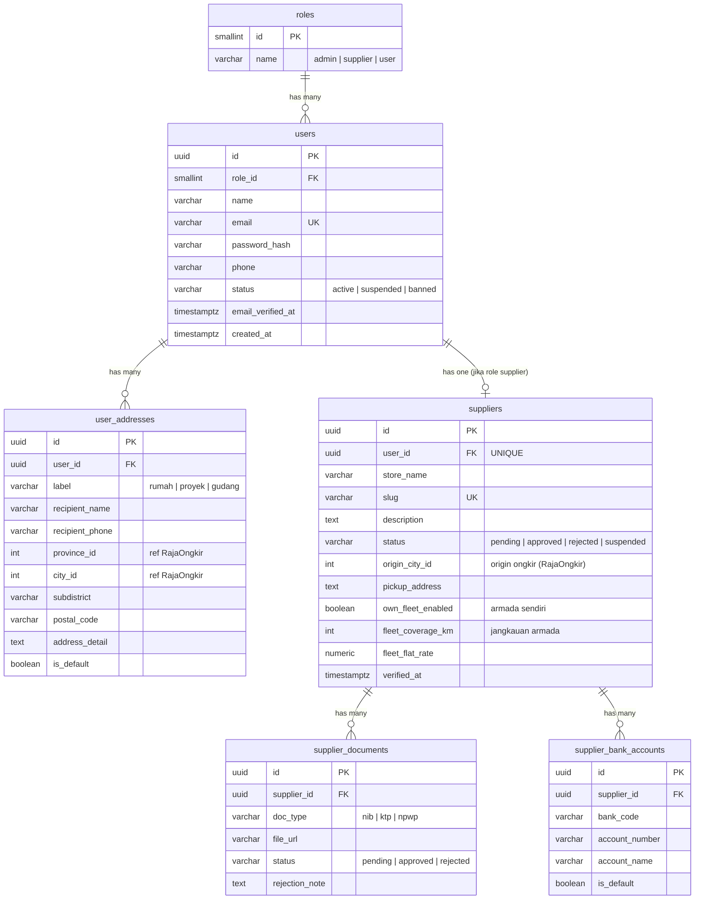
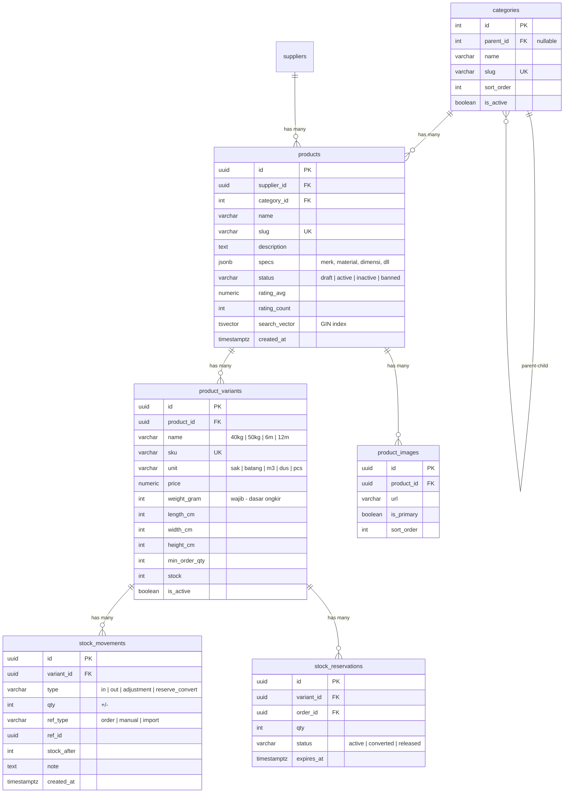
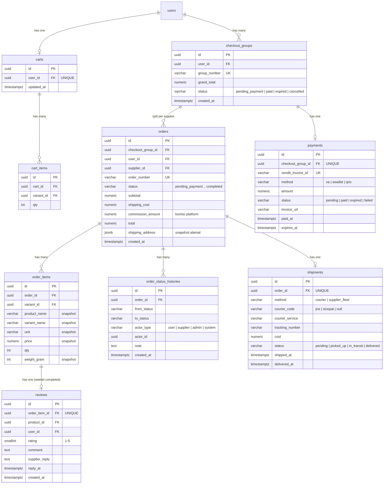
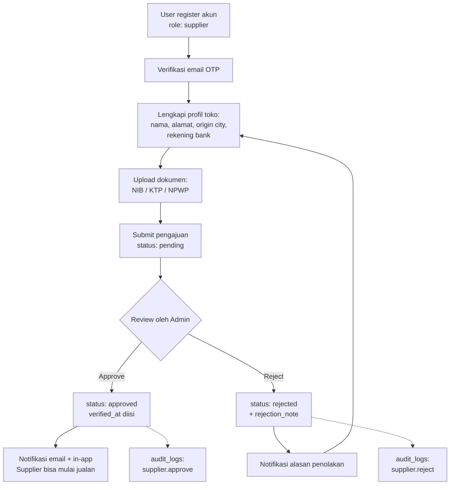
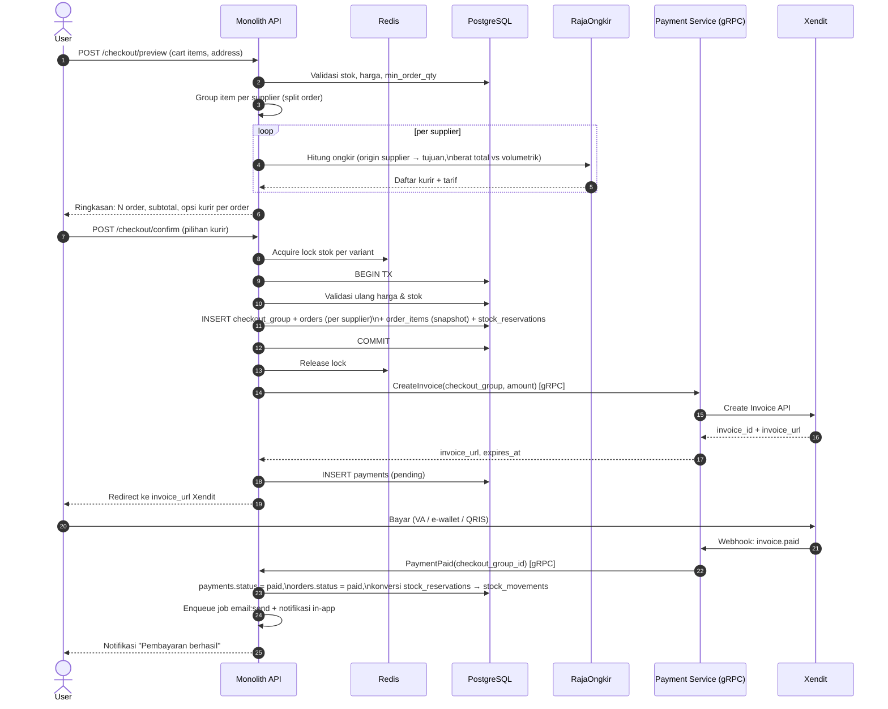
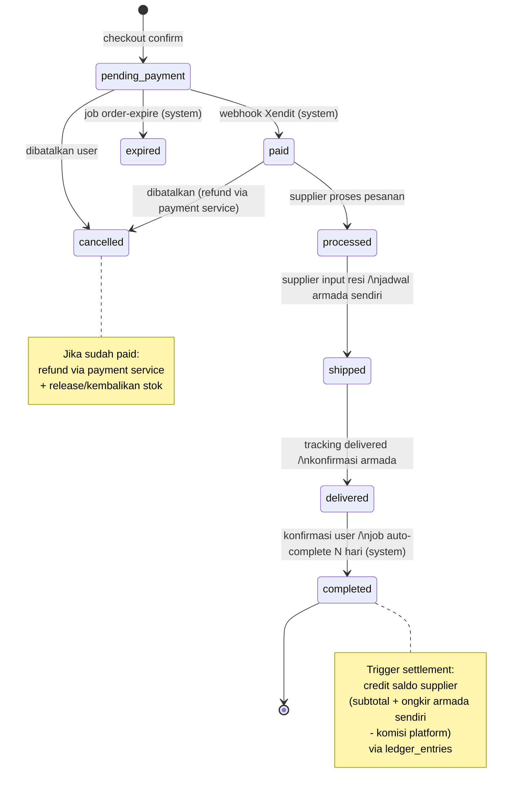
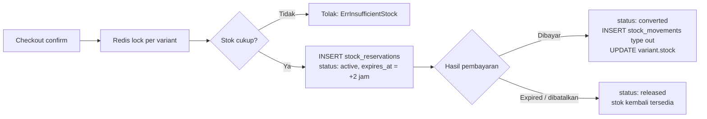
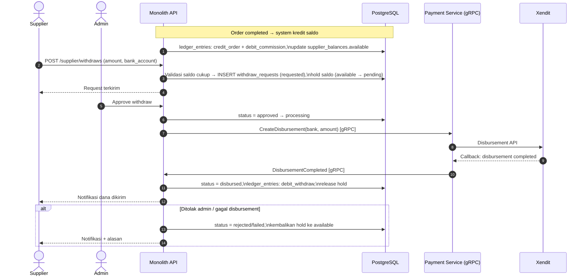
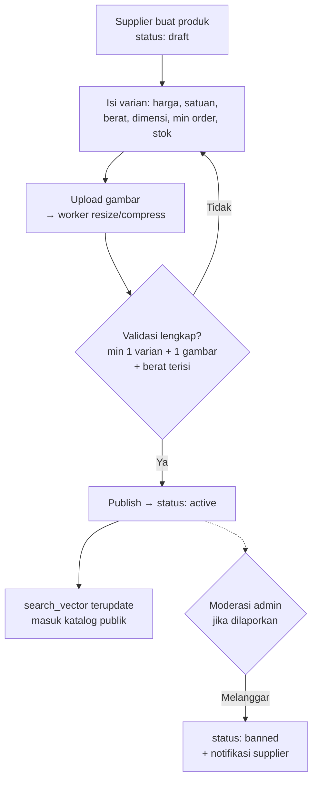

# ERD & Alur Proses — Marketplace Bahan Bangunan

Semua diagram menggunakan Mermaid. ERD dipecah per domain agar mudah dibaca; relasi lintas domain dicatat di bagian akhir ERD.

---

## 1. ERD

### 1.1 Domain: User, Role & Supplier



### 1.2 Domain: Katalog & Inventory



### 1.3 Domain: Cart, Checkout, Order & Shipping



### 1.4 Domain: Finance (Payout), Notifikasi & Lainnya

```mermaid
erDiagram
    suppliers ||--|| supplier_balances : "has one"
    suppliers ||--o{ ledger_entries : "has many"
    suppliers ||--o{ withdraw_requests : "has many"
    supplier_bank_accounts ||--o{ withdraw_requests : "target"
    users ||--o{ notifications : "has many"
    users ||--o{ wishlists : "has many"
    users ||--o{ audit_logs : "actor"

    supplier_balances {
        uuid supplier_id PK_FK
        numeric available_balance
        numeric pending_balance "order belum completed"
        timestamptz updated_at
    }

    ledger_entries {
        uuid id PK
        uuid supplier_id FK
        varchar entry_type "credit_order | debit_commission | debit_withdraw | credit_refund_reversal"
        numeric amount
        varchar ref_type "order | withdraw"
        uuid ref_id
        numeric balance_after
        timestamptz created_at "append-only, tanpa update/delete"
    }

    withdraw_requests {
        uuid id PK
        uuid supplier_id FK
        uuid bank_account_id FK
        numeric amount
        varchar status "requested | approved | processing | disbursed | rejected | failed"
        uuid processed_by "admin user_id"
        varchar disbursement_id "ref payment service"
        text rejection_note
        timestamptz created_at
    }

    notifications {
        uuid id PK
        uuid user_id FK
        varchar type "order_update | approval | payout | system"
        varchar title
        text body
        jsonb data "deeplink payload"
        timestamptz read_at
        timestamptz created_at
    }

    wishlists {
        uuid id PK
        uuid user_id FK
        uuid product_id FK
    }

    audit_logs {
        uuid id PK
        uuid actor_id FK
        varchar action "supplier.approve | product.ban | withdraw.approve"
        varchar entity_type
        uuid entity_id
        jsonb metadata "before/after"
        varchar ip_address
        timestamptz created_at
    }

    banners {
        uuid id PK
        varchar title
        varchar image_url
        varchar link_url
        boolean is_active
        int sort_order
        timestamptz starts_at
        timestamptz ends_at
    }
```

### 1.5 Relasi Lintas Domain (ringkasan)

- `suppliers.user_id → users.id` (1:1, unik — satu akun satu peran sesuai keputusan `role_id` di `users`)
- `products.supplier_id → suppliers.id`
- `cart_items.variant_id → product_variants.id`
- `orders.supplier_id → suppliers.id`, `orders.user_id → users.id`
- `stock_reservations.order_id → orders.id`
- `ledger_entries.ref_id → orders.id / withdraw_requests.id`
- `reviews.product_id → products.id` (agregat rating disimpan denormalized di `products`)

---

## 2. Alur Proses

### 2.1 Registrasi & Approval Supplier



### 2.2 Checkout & Pembayaran (end-to-end)



Jika tidak dibayar sampai `expires_at`, job `order:expire` di worker akan mengubah status menjadi `expired`, me-release semua `stock_reservations`, dan mengirim notifikasi.

### 2.3 State Machine Status Order



Aturan aktor per transisi: `paid → processed → shipped` hanya supplier; `delivered → completed` oleh user atau system; `cancelled` mengikuti aturan di atas; admin dapat melakukan intervensi dengan pencatatan di `audit_logs`. Semua transisi dicatat di `order_status_histories`.

### 2.4 Reservasi Stok (lifecycle)



### 2.5 Payout / Withdraw Supplier



### 2.6 Publikasi Produk oleh Supplier



---

## 3. Catatan Implementasi Terkait Diagram

- **Snapshot di `order_items` dan `orders.shipping_address`** memastikan perubahan harga/alamat setelah checkout tidak mengubah data historis order.
- **Satu `payments` per `checkout_group`** — Xendit menerima satu invoice untuk seluruh grup; pembagian dana ke supplier terjadi di level ledger, bukan di level pembayaran.
- **`ledger_entries` append-only** dengan `balance_after` membuat saldo bisa direkonstruksi dan diaudit kapan pun; `supplier_balances` hanyalah materialized snapshot.
- **`search_vector` (tsvector)** diisi via trigger atau saat update produk, di-index GIN untuk full-text search tanpa perlu Elasticsearch di fase awal.
- Semua diagram ini konsisten dengan keputusan sebelumnya: `role_id` FK langsung di `users`, monolith + 2 service gRPC, tanpa voucher & unit converter.
