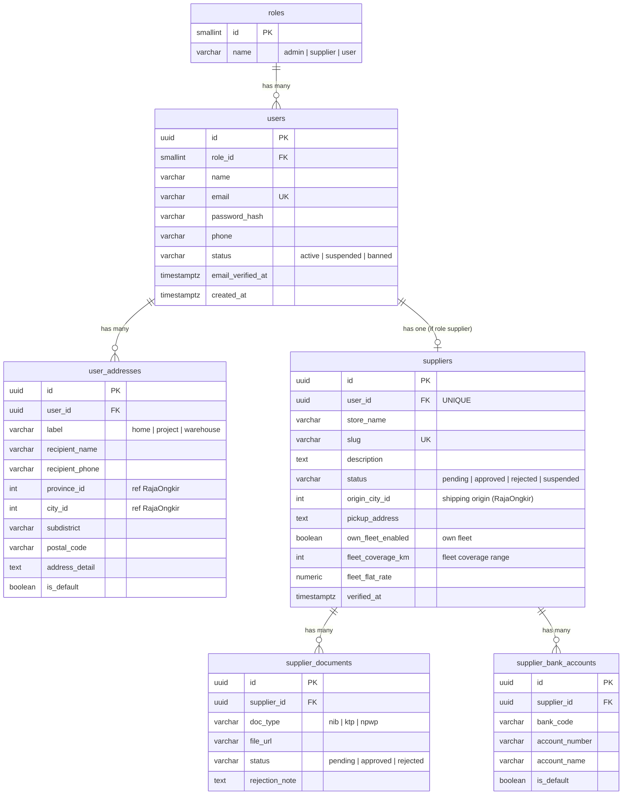
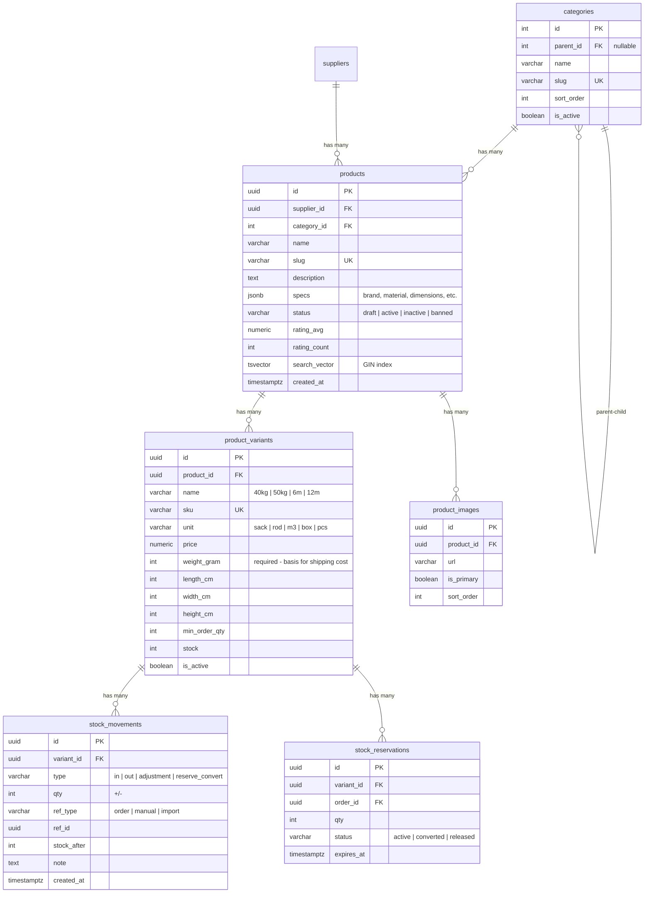
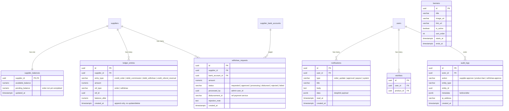
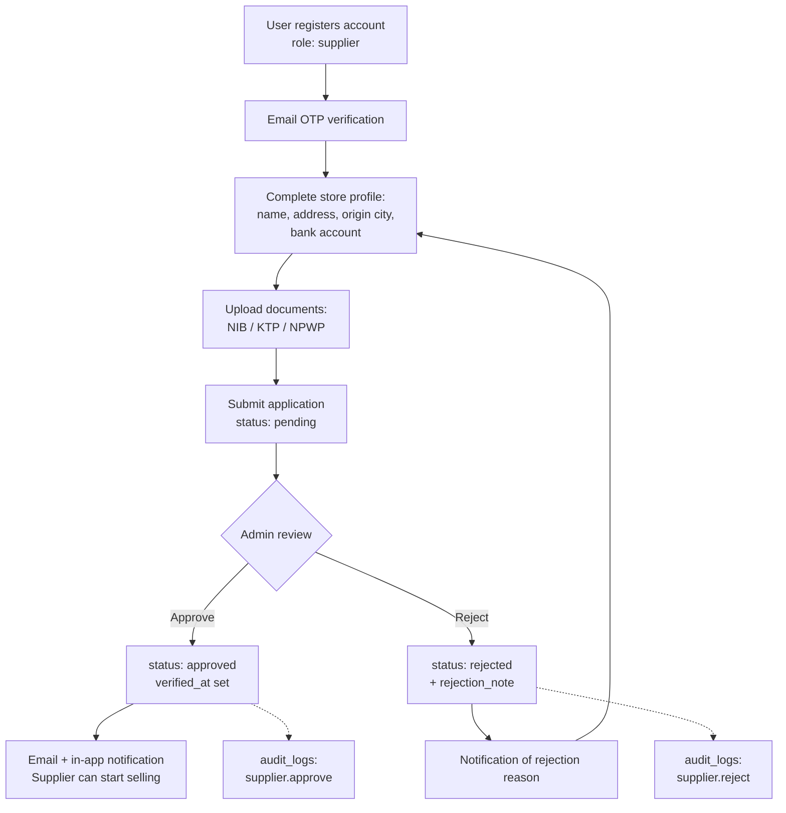
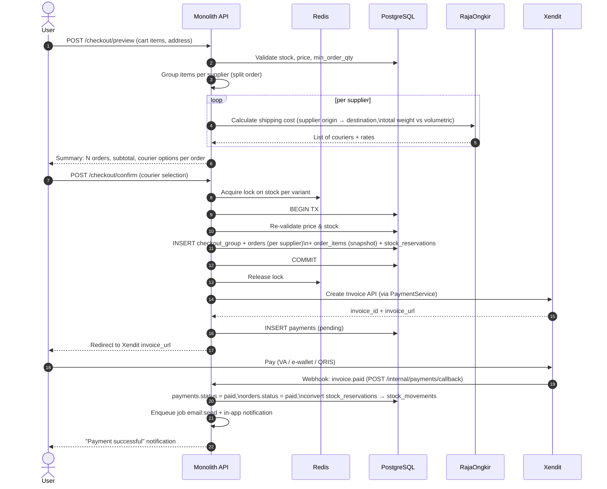
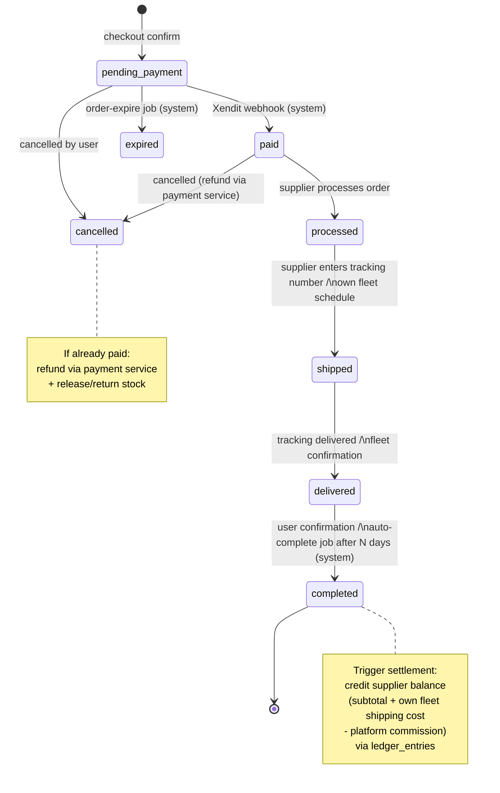
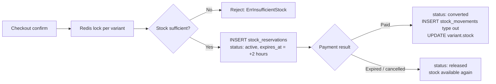
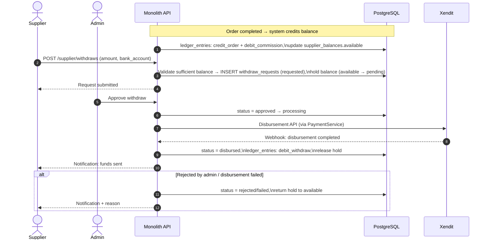
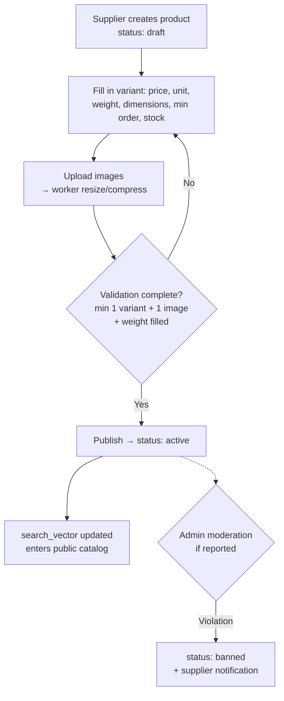

# ERD & Process Flows — Building Materials Marketplace

All diagrams use Mermaid. The ERD is split per domain for readability; cross-domain relations are noted at the end of the ERD section.

---

## 1. ERD

### 1.1 Domain: User, Role & Supplier

### 1.2 Domain: Catalog & Inventory

### 1.3 Domain: Cart, Checkout, Order & Shipping

### 1.4 Domain: Finance (Payout), Notifications & Others

### 1.5 Cross-Domain Relations (summary)

- `suppliers.user_id → users.id` (1:1, unique — one account, one role per the `role_id` decision in `users`)
- `products.supplier_id → suppliers.id`
- `cart_items.variant_id → product_variants.id`
- `orders.supplier_id → suppliers.id`, `orders.user_id → users.id`
- `stock_reservations.order_id → orders.id`
- `ledger_entries.ref_id → orders.id / withdraw_requests.id`
- `reviews.product_id → products.id` (rating aggregate stored denormalized in `products`)

---

## 2. Process Flows

### 2.1 Supplier Registration & Approval

### 2.2 Checkout & Payment (end-to-end)

If not paid by `expires_at`, the `order:expire` job in the worker will change the status to `expired`, release all `stock_reservations`, and send a notification.

### 2.3 Order Status State Machine

Actor rules per transition: `paid → processed → shipped` supplier only; `delivered → completed` by user or system; `cancelled` follows the rules above; admin can intervene with logging in `audit_logs`. All transitions are recorded in `order_status_histories`.

### 2.4 Stock Reservation (lifecycle)

### 2.5 Supplier Payout / Withdraw

### 2.6 Product Publishing by Supplier

---

## 3. Implementation Notes Related to the Diagrams

- **Snapshots in `order_items` and `orders.shipping_address`** ensure that price/address changes after checkout do not alter historical order data.
- **One `payments` per `checkout_group`** — Xendit receives a single invoice for the entire group; fund distribution to suppliers happens at the ledger level, not at the payment level.
- **`ledger_entries` append-only** with `balance_after` makes balances reconstructable and auditable at any time; `supplier_balances` is merely a materialized snapshot.
- **`search_vector` (tsvector)** populated via trigger or on product update, GIN-indexed for full-text search without needing Elasticsearch in the early phase.
- All these diagrams are consistent with prior decisions: `role_id` FK directly on `users`, single monolith with internal adapters for payment/notification/shipping (no separate services), no voucher & unit converter.
